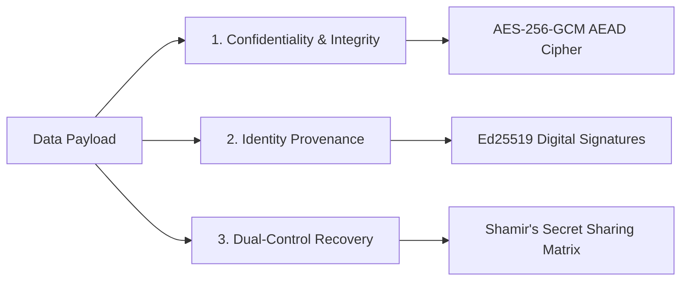

# Crypto Custody Engine

The Crypto Custody Engine is a zero-dependency, production-grade security utility that demonstrates enterprise key management, data provenance, and decentralized trust orchestration.

Built with TypeScript and Node.js core cryptographic primitives, the engine models how a cryptographic security lead safeguards sensitive data against unauthorized modification, internal collusion, and single-point-of-failure risks.

## Table of Contents

- [Security Architecture](#security-architecture)
- [Core Security Pillars](#core-security-pillars)
- [Architectural Compliance Profile](#architectural-compliance-profile)
- [License](#license)

## Security Architecture

The platform is engineered around three decoupled cryptographic vectors to provide layered defenses:

## Core Security Pillars

### 1. Authenticated Confidentiality at Rest (AES-256-GCM)

Implements Authenticated Encryption with Associated Data (AEAD). The engine generates cryptographically isolated 12‑byte initialization vectors (IVs) and validates a 16‑byte Galois authentication tag on every read. Any tampering of the stored ciphertext causes authentication to fail and the read operation is rejected.

### 2. Non-Repudiation & Identity Provenance (Ed25519)

Protects against insider asset-swapping and forgery. Even if an actor possesses the symmetric storage key, they cannot forge Ed25519 signatures without the security officer’s isolated private key, preserving an auditable chain of custody.

### 3. Split‑Knowledge Dual‑Control Governance (M‑of‑N Threshold)

Eliminates root-key single points of failure. The master data‑encryption key is split into $N$ polynomial shares; reconstruction requires a threshold of $M$ shares during a key‑ceremony. This enforces dual‑control governance and prevents unilateral administrative overrides.

## Architectural Compliance Profile

- **Language standards:** Pure TypeScript compiled as ECMAScript Modules (ESM / NodeNext).
- **Regulatory alignment:** Modeled against NSM (Nasjonal sikkerhetsmyndighet) cryptographic recommendations and NIST key lifecycle guidance.
- **Zero dependencies:** Uses only native, hardware‑accelerated Node.js modules (`crypto`, `buffer`) to reduce supply‑chain risk.

